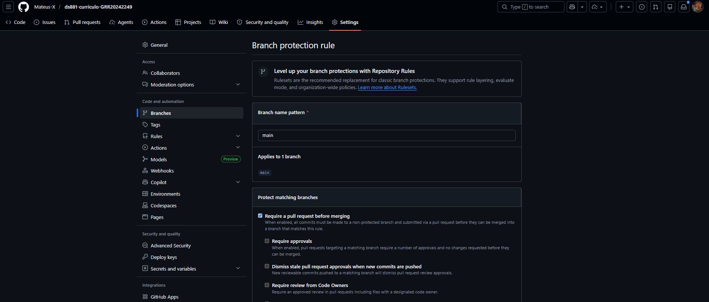

# Currículo Online DS881 - Mateus de Castro Xavier

## Link Prod
**[[Pages](https://mateus-x.github.io/ds881-curriculo-GRR20242249/)]**

## Como executar o ambiente localmente (Docker)

Requisitos.

1. Ter o **Docker** e o **Docker Compose** instalados.
2. Clonar este repositório e acesse a pasta raiz.
3. No terminal, executar:
   ```bash
   docker-compose up --build
   ```


## Print de branch-protection

